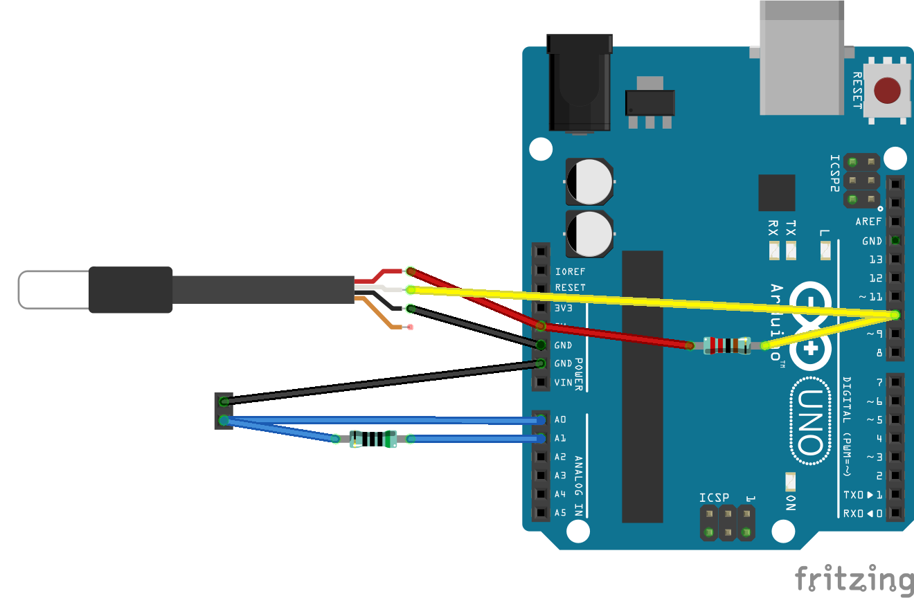

# EC PPM Measurement Sensor

I have modified the work done by `Michael Ratcliffe  Mike@MichaelRatcliffe.com` around his EC PPM Measurement Code, you can find of this at his [hackday.io post here](https://hackaday.io/project/7008-fly-wars-a-hackers-solution-to-world-hunger/log/24646-three-dollar-ec-ppm-meter-arduino?page=2#discussion-list)

This are my curated steps to get this up an running

## Build the Sensor

[photo of the sensor]

## Testing and calibrating

Build up the following schematics in a protoboard:

Get a glass of your (recently) mixed water with sales solutions and put the sensor in it.

### Installation

Open Arduino IDE and install the following libraries (you can get them from the Manager):
* DallasTemperature: https://github.com/milesburton/Arduino-Temperature-Control-Library
* OneWire: https://github.com/adafruit/MAX31850_OneWire

### Calibration

1. Upload `./calibration` code into the Arduino Uno.
2. Open Serial Monitor at 9600 baudrate.
3. You will see messages of calibration, wait a couple of minutes (~3 calibration times) until the error of "Temperature" goes off
4. Take not of the `K` value in the calibration message

### Test Calibration

1. Open `./test_calibration`
2. Setup your `K` value
3. Upload the code into the same Arduino Uno of the Calibration step
4. Check the serial for measurements with your glass of solution
5. You can now get a new glass of clean water without solution, set the sensor and check measurements

Those would be the measurements to detect when the water is full of sales and when it has runout of them.

### Setup Hydroponic Tower

> TODO: set this values into ../hydroponic/config
