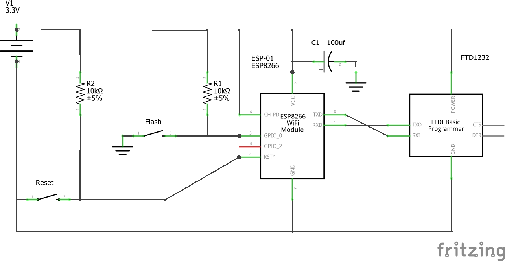
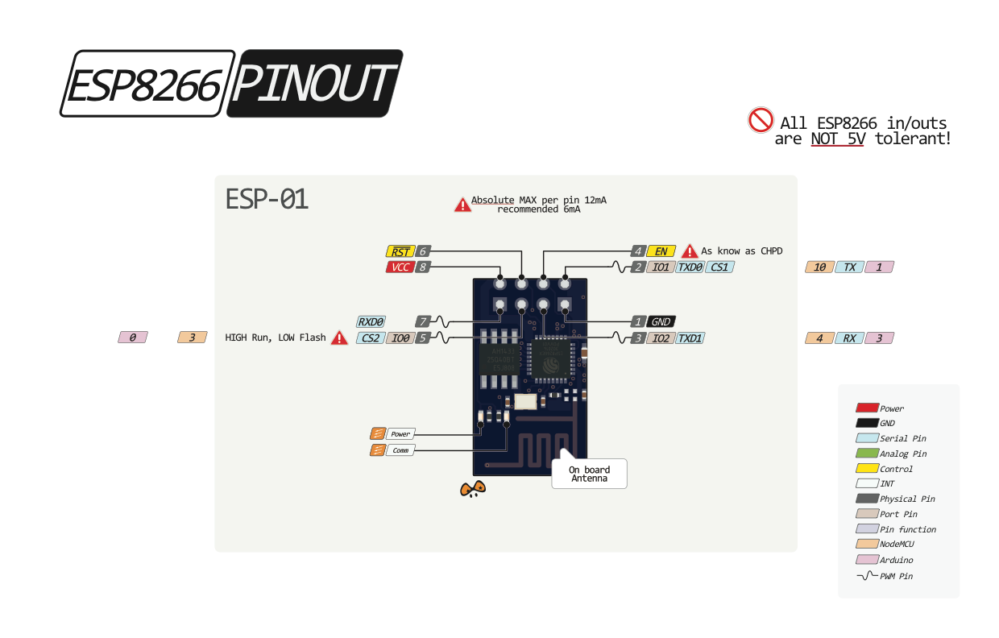

# Manage ESP-01

## Install and configure Arduino IDE

1. Download and install [Arduino IDE](https://www.arduino.cc/en/Main/Software) 1.6.8+
2. Add support to ESP8266 > follow [this guide](https://learn.sparkfun.com/tutorials/esp8266-thing-hookup-guide/installing-the-esp8266-arduino-addon)
3. Add Library [PubSubClient](https://github.com/knolleary/pubsubclient)
4. Add library [SerialCommands](https://github.com/ppedro74/Arduino-SerialCommands)

## Setting up PubSub.ino
The idea behind it is to upload a code into ESP-01 that will serve as a PubSub server & client. Then the Arduino from the Hydroponics will be communicating with the ESP-01 through Serial.

You need the above libraries and a way to upload code into the ESP-01 (below are some methods)

Configure your settings at `./pubsub/config.h` and upload the code into the ESP-01

## How to upload code into ESP-01

* You will need an FTDI USB/UART (ie [FTD1232](https://www.kozo.ch/j/smarthome/9852-ftd1232-usb-to-ttl-serial-adapter-3-3v-and-5v-operation))
* [Or you can use an Arduino Uno](https://www.hackster.io/pratikdesai/how-to-program-esp8266-esp-01-module-with-arduino-uno-598166)
* Or a board to upload like [this one](http://www.arjunsk.com/iot/programming-esp8266-esp-01-using-esp8266-programmer-ch340g-chip-adapter/)

### Schematics



## Uploading code

This option is to upload code directly to the ESP

1. Choose from the Arduino IDE menu File > Examples > ESP8266 > Blink
2. Set the board as `Generic ESP8266 Module`
2. Set Programmer into `Arduino as ISP`
3. Press and hold FLASH button
4. Press once RESET button - keep holding FLASH button
5. Click Upload code at Arduino IDE (without releasing FLASH)
6. It will compile and then when it starts uploading (showing uploading dots) > release FLASH button

To test it put any LED in GPIO_2 and GND, it will blink every 2 seconds.

--------

## Try AT Commands
Open Serial at 115200 and plug in the ESP with the FTDI and type

```AT```

should respond with `OK`. 
[AT commands](https://www.espressif.com/sites/default/files/documentation/4a-esp8266_at_instruction_set_en.pdf)

## Flash ESP

* Download a firmware from [espressif](https://www.espressif.com/en/products/hardware/esp8266ex/resources)
* Flash it by downloading the esptool "Flash Download Tools (ESP8266 & ESP32)" from same place

-----------

## Resources

* [ESP docs](https://arduino-esp8266.readthedocs.io/en/latest/)