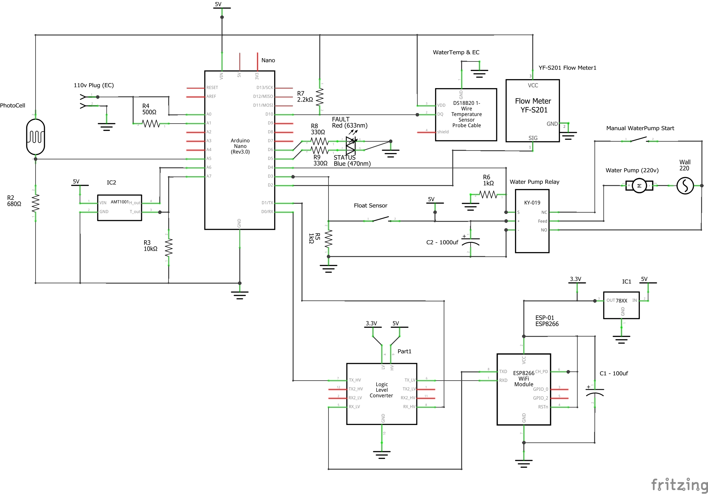

# Electronics

[TODO: Overview of the components]

## Schematics

## Bill of Materials (BOM)
[BOM](./hydroponics_bom.html)

---

## Arduino Libraries

The following libraries are needed from arduino (there are others embedded)

* ESP8266 > follow [this guide](https://learn.sparkfun.com/tutorials/esp8266-thing-hookup-guide/installing-the-esp8266-arduino-addon)
* [PubSubClient](https://github.com/knolleary/pubsubclient)
* [SerialCommands](https://github.com/ppedro74/Arduino-SerialCommands)
* [RTClib](https://github.com/adafruit/RTClib)

---

## MQTT

### Topics

* `[Tower-ID]/status`: `ONLINE` / `OFFLINE` state of the tower with the Broker
* `[Tower-ID]/env/temp`: External Temperature (centigrade)
* `[Tower-ID]/env/hum`: External Humidity (0 - 100)
* `[Tower-ID]/env/light`: Current sunlight on the Tower (0 - 100)
* `[Tower-ID]/water/temp`: Water Temperature (centigrade)
* `[Tower-ID]/water/ec`: Electric Conductivity of the Water (siemens)
* `[Tower-ID]/water/tds`: Total Dissolved Solids in the water (PPM) 
* `[Tower-ID]/water/pump/state`: Enum of the WaterPump State (idle/off = 0, on = 1, err_level = 2, err_flow = 3)
* `[Tower-ID]/water/pump/flow`: Current Water flow (litres / hour)
* `[Tower-ID]/water/pump/power`: Turn On/Off the pump by sending 1 or 0
* `[Tower-ID]/box/temp`: Electronics Box Temperature (centigrade)
* `[Tower-ID]/box/time`: Current electronics time (unix epoch)
* `[Tower-ID]/errors`: Errors - TODO

---

## Serial Commands

* `RST`: Resets the ESP module.
* `SET;WIFI;[SSID];[password]`: Set and connects to a Wifi
* `SET;MQTT;[HOST];[PORT];[Tower-ID]`: Set and connects to a MQTT Broker
* `PUB;[topic];[value]`: Publish a message using as topic `[Tower-ID]/[topic]` and the `value` as payload.

### Responses:

* `READY`: command get when the module is up and running.
* `WIFI;ON`: Wifi connected
* `WIFI;TRY`: Wifi connecting
* `WIFI;OFF;[status]`: Wifi disconnected with a Wifi.status() reason
* `MQTT;ON`: MQTT broker connected
* `MQTT;TRY`: MQTT broker connecting

Errors
* `ERROR;unknown command;[command received]`: through when the command wasn't recognized.
* `ERROR;SET;TYPE NOT WIFI OR MQTT`: Fired after a `SET` command when the type is incorrect
* `ERROR;PUB;BROKER OFFLINE`: tried to publish but MQTT broker is offline
* `ERROR;PUB;TOPIC`: No topic in `PUB` message
* `ERROR;PUB;VALUE`: No value in `PUB` message

