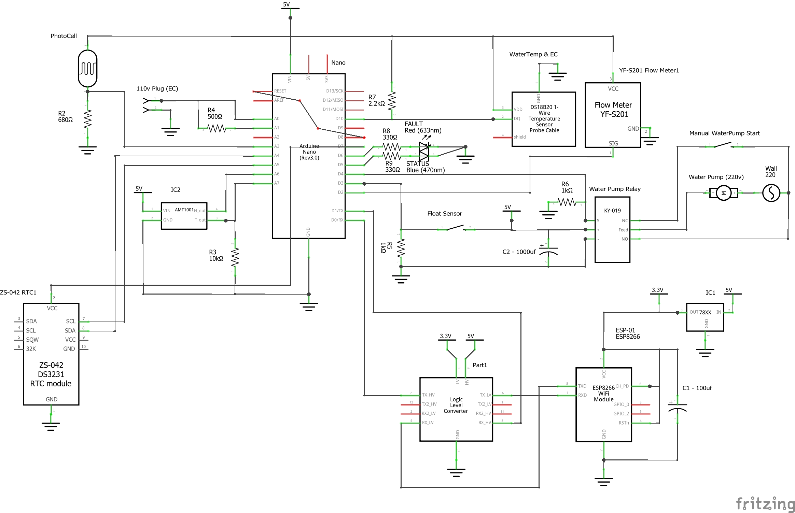

# Electronics

[TODO: Overview of the components]

## Schematics

## Bill of Materials

[TODO]

---

## MQTT

### Topics

* `[Tower-ID]/status`: `ONLINE` / `OFFLINE` state of the tower with the Broker
* `[Tower-ID]/env/temp`: External Temperature (centigrade)
* `[Tower-ID]/env/hum`: External Humidity (0 - 100)
* `[Tower-ID]/env/light`: Current sunlight on the Tower (0 - 100)
* `[Tower-ID]/water/temp`: Water Temperature (centigrade)
* `[Tower-ID]/water/ec`: Electric Conductivity of the Water (siemens)
* `[Tower-ID]/water/tds`: Total Dissolved Solids in the water (PPM) 
* `[Tower-ID]/water/pump/state`: Enum of the WaterPump State (idle/off = 0, on = 1, err_level = 2, err_flow = 3)
* `[Tower-ID]/water/pump/flow`: Current Water flow (litres / hour)
* `[Tower-ID]/errors`: Errors - TODO

---

## Serial Commands

* `SET;WIFI;[SSID];[password]`: Set and connects to a Wifi
* `SET;MQTT;[HOST];[PORT];[Tower-ID]`: Set and connects to a MQTT Broker
* `PUB;[topic];[value]`: Publish a message using as topic `[Tower-ID]/[topic]` and the `value` as payload.

