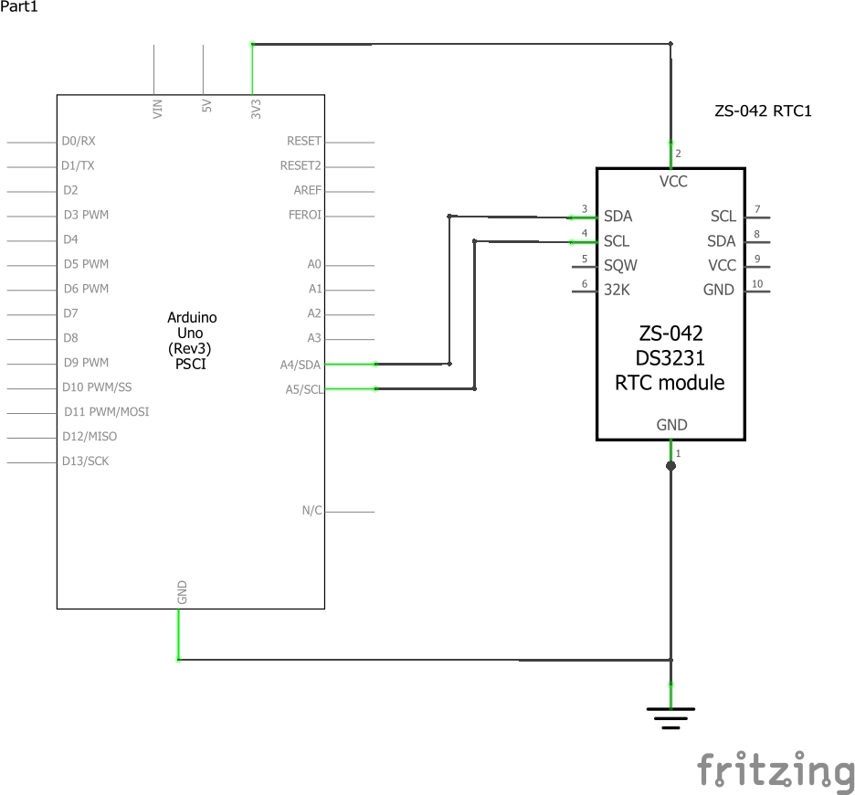

# RealTimeClock (RTC)

This is a quick sketch to test out CRON expressions using RTC DS3231 Module.

## Schematics

---

For this test I've used an Arduino Uno, any AVR architecture would do the job

The following libraries are needed

* [Sodaq_DS3231](https://github.com/SodaqMoja/Sodaq_DS3231)
* [CronAlarms](https://github.com/Martin-Laclaustra/CronAlarms)

## What does it do ?

It set the time into the AVR time from DS3231 Module and then creates scheduled tasks using [cron expression](https://en.wikipedia.org/wiki/Cron#CRON_expression).
> you must configure the time into it first: you can do that by uploading the [adjust example from Sodaq lib](https://github.com/SodaqMoja/Sodaq_DS3231/blob/master/examples/adjust/adjust.pde)

Creates 2 scheduled tasks:
* Every 15 seconds: runs an "ON" command: which then schedules a one time command "OFF" at 5 seconds.
* Every 30 seconds shows the current temperature of the DS3231 module
